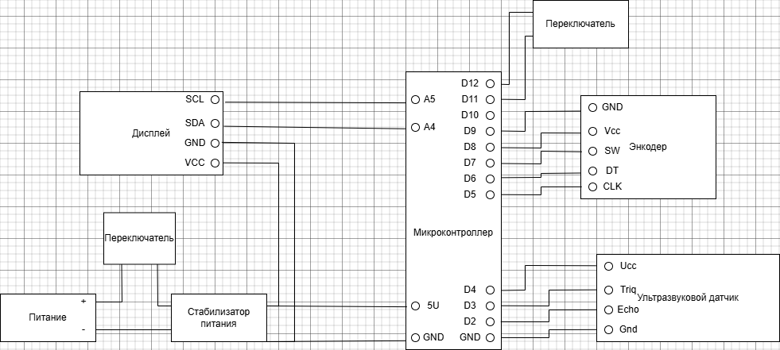
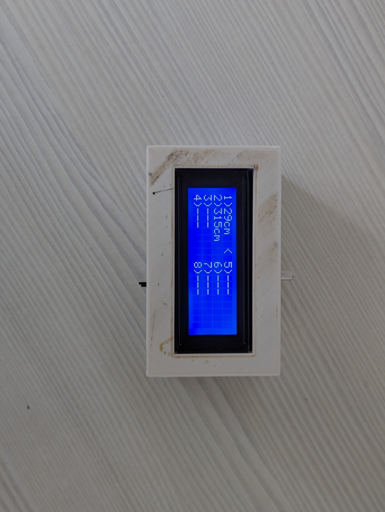
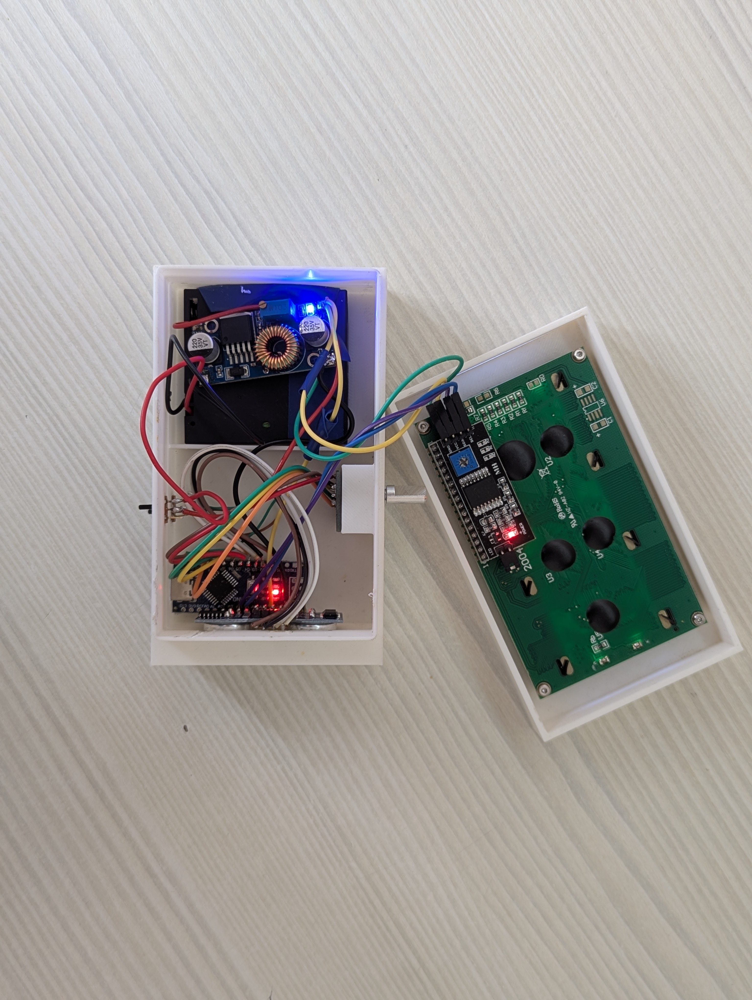

# Ультразвуковой дальномер

Проект автономного ультразвукового дальномера, выполненный в рамках проектной практики (НИЯУ МИФИ). Устройство представляет собой законченный прибор в кастомном корпусе с возможностью сохранения замеров в память.

## Основной функционал устройства
* Измерение расстояния с помощью датчика HC-SR04.
* Фильтрация показаний (медианный фильтр по 3 отсчетам) для устранения случайных скачков и шумов сонара.
* Сохранение до 8 последних измерений в энергонезависимую память (EEPROM) микроконтроллера. Данные не сбрасываются при отключении питания.
* Возможность учета габаритов корпуса (+12 см к замеру) при переключении тумблера режима.
* Вывод информации на LCD-дисплей 20x4 крупным шрифтом с помощью библиотеки BigFont01_I2C.
* Управление через инкрементальный энкодер: выбор ячейки памяти поворотом, запуск измерения кликом, сброс ячейки удержанием и полная очистка памяти двойным кликом.

---

## Принципиальная схема
Схема соединений компонентов и питания устройства:

Полная схема в формате для печати находится в файле [schematic.pdf](hardware/schematic.drawio.pdf).

---

## Структура репозитория

* /rangefinder — исходный код прошивки для Arduino (.ino файл).
* /hardware — принципиальная схема устройства в форматах PDF и PNG (сделана в draw.io).
* /3d_models — файлы корпуса для сборки и производства:
  * rangefinder_assembly.stp — общая трехмерная сборка корпуса.
  * case-front.stl / case-back.stl — отдельные детали корпуса, готовые для отправки в слайсер и 3D-печать.

---

## Использованные библиотеки
Для успешной компиляции скетча требуются следующие библиотеки:
* NewPing — для работы с ультразвуковым датчиком.
* EncButton — для обработки сигналов энкодера и кнопки без дребезга.
* LiquidCrystal_I2C — для управления дисплеем по шине I2C.
* BigFont01_I2C — для отрисовки больших цифр на экране.
* EEPROM (встроенная) — для сохранения данных.

---

##  Фото готового устройства
\
